<p align="center">
  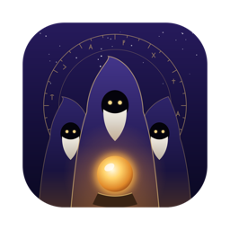
</p>

<h1 align="center">Magisterium</h1>

<p align="center">
  <strong>Convene a council of AIs.</strong><br />
  Claude, Gemini, your local models and any API answer the same question,<br />
  critique each other, and hand you one verdict.
</p>

<p align="center">
  
  
  
  
  
  <a href="LICENSE"></a>
</p>

<p align="center">
  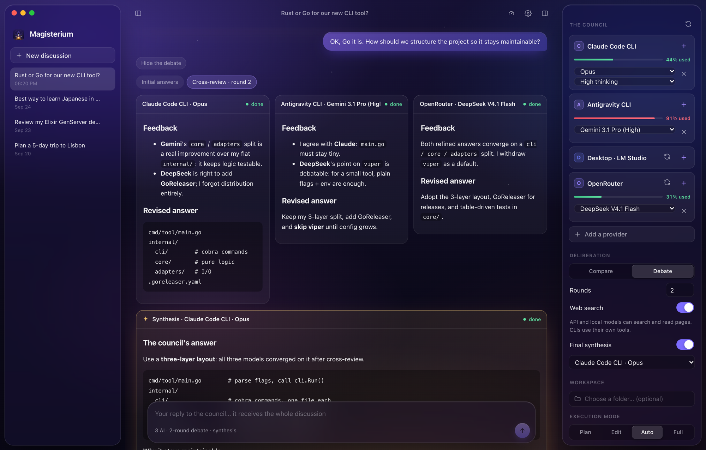
</p>

---

## Why a council?

One model gives you one answer, blind spots included. Magisterium runs **several models in parallel**, lets them **read and critique each other's answers**, then has one of them **write the final synthesis**. It keeps what everyone got right, fixes what someone got wrong, and settles the disagreements.

In practice it catches the stuff a single model gets confidently wrong: an outdated fact that another model corrects, or a missing edge case that a reviewer points out.

|                       | One AI         | The council                               |
| --------------------- | -------------- | ----------------------------------------- |
| Answers               | 1              | 2 to 5 in parallel, plus a synthesis      |
| Errors                | Go unnoticed   | Flagged by the other members              |
| Disagreements         | Invisible      | Surfaced and settled explicitly           |
| Your subscriptions    | One at a time  | Claude Code, Antigravity, APIs and local models side by side |

## Features

- 🧙 **Council modes.** *Compare* sends the same prompt to every member at once. *Debate* adds 2 to 5 rounds of cross-review, where each AI reads the others, critiques them and revises its own answer. An optional **final synthesis** can be written by any model you choose.
- 💬 **Real conversations.** Follow-up messages carry the whole thread (your prompts and the council's syntheses), so the council builds on its previous conclusions. Every discussion is saved locally and can be reopened.
- 🔌 **Bring your own AIs.**
  - **CLIs**: **Claude Code CLI** and **Antigravity CLI** are detected automatically and use your existing subscriptions.
  - **Local servers**: LM Studio, Ollama, or any OpenAI-compatible URL, including another machine on your network.
  - **Cloud APIs**: Anthropic, OpenAI, Gemini, DeepSeek, OpenRouter, Mistral, Groq, xAI, Together, Ollama Cloud.
- 🧠 **Per-model control.** Pick the model and the **thinking effort** (low → max for Claude) for each member. Add the same provider twice with different models if you like.
- 🌐 **Web access for every model.** API and local models get `web_search` and `fetch_url` tools, executed by the app. Search runs through a **built-in SearXNG**, Tavily, or your own SearXNG instance.
- 📊 **Usage limits at a glance.** Claude Code and Antigravity 5-hour and weekly windows, OpenRouter and DeepSeek balances, Tavily credits, each with a reset countdown. A mini gauge on every council member warns you before you hit a wall. Checking is free: no tokens spent.
- 👀 **See them think.** Answers stream live. Reasoning (when the provider exposes it), searches and pages read appear inside each card.
- 🛡️ **Execution modes for agents**: *Plan* (read-only), *Edit*, *Auto*, *Full access*, applied to the CLI agents working in your project folder.
- 🍏 **Native feel.** Liquid-glass UI on real macOS vibrancy, collapsible side panels (`⌘B` / `⌘J`), and animations tuned with Emil Kowalski's and Apple's motion principles. Reduced-motion and reduced-transparency are respected.
- 🌍 **Four languages**: English, Français, Español, العربية (right-to-left). The instructions sent to the models follow the UI language too.

## How a session works

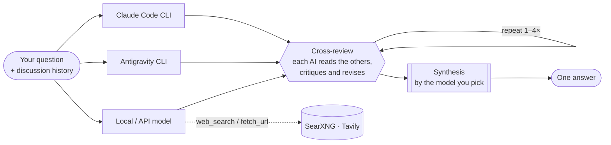

## Screenshots

<table>
  <tr>
    <td width="50%">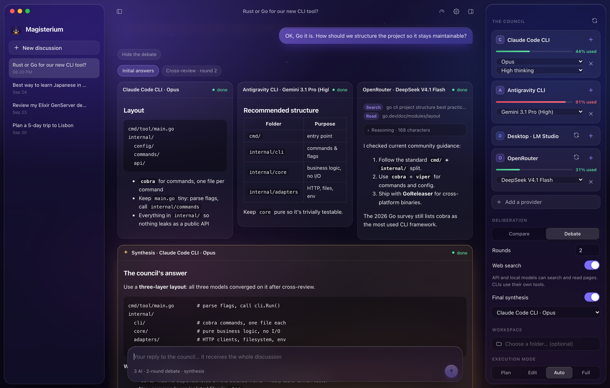<br /><sub><b>Web tools & reasoning:</b> an API model searches, reads a page, and shows its chain of thought.</sub></td>
    <td width="50%">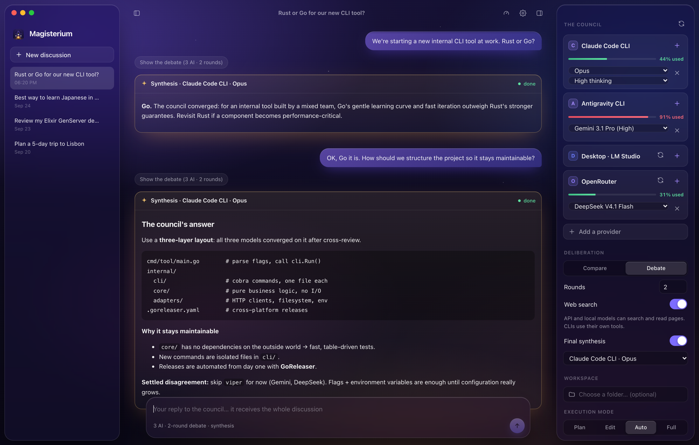<br /><sub><b>Threaded discussions:</b> collapse the debates and read it like a chat, one verdict per turn.</sub></td>
  </tr>
  <tr>
    <td>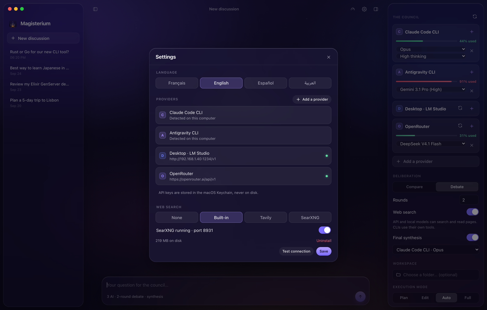<br /><sub><b>Settings:</b> language, detected CLIs, configured providers and web search engine.</sub></td>
    <td>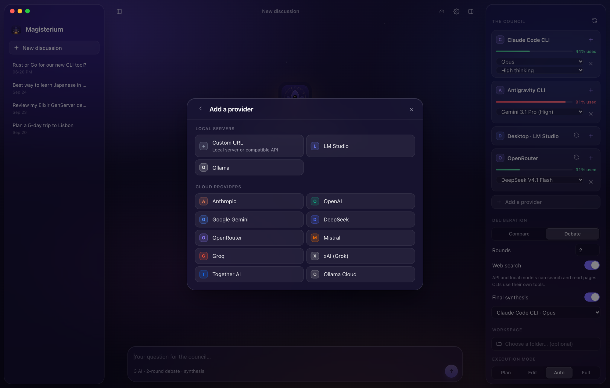<br /><sub><b>Add a provider:</b> local servers and cloud presets, with a connection test before saving.</sub></td>
  </tr>
  <tr>
    <td>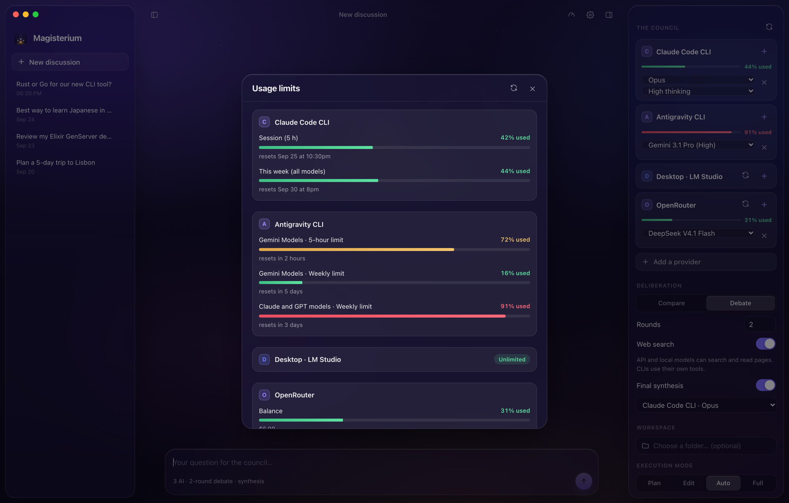<br /><sub><b>Usage limits:</b> subscription windows, API balances and reset times, read at no cost.</sub></td>
    <td>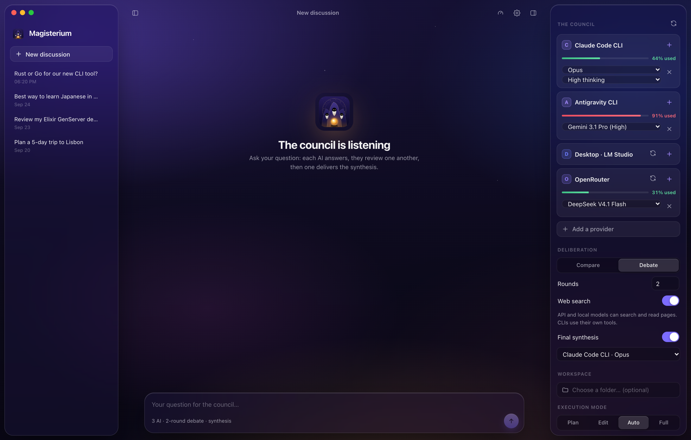<br /><sub><b>Ready to convene:</b> your council, its deliberation mode and workspace on the right.</sub></td>
  </tr>
  <tr>
    <td>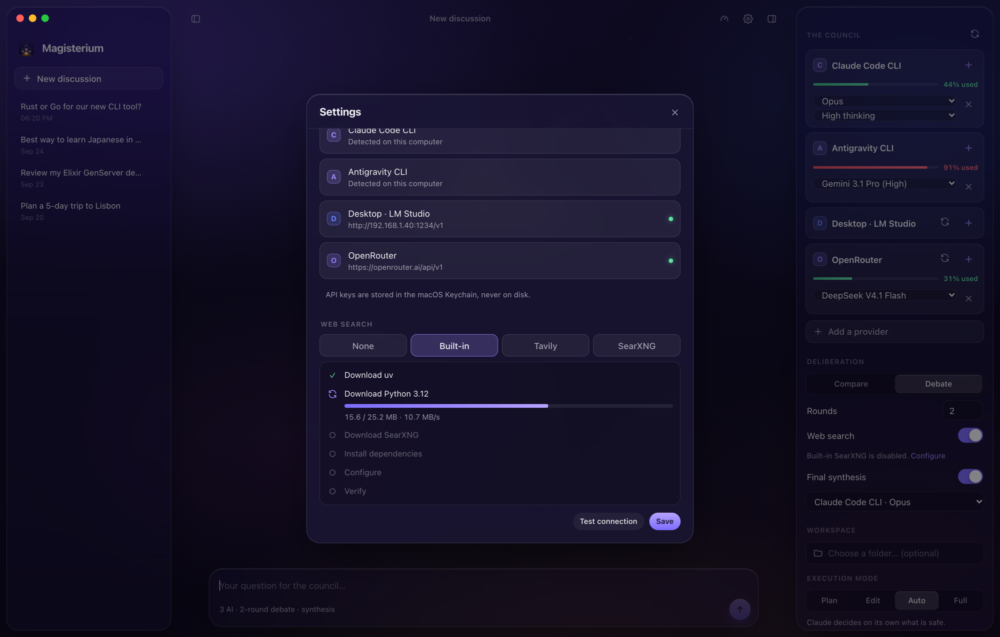<br /><sub><b>Built-in SearXNG:</b> installed on demand, with every step and live download progress.</sub></td>
    <td>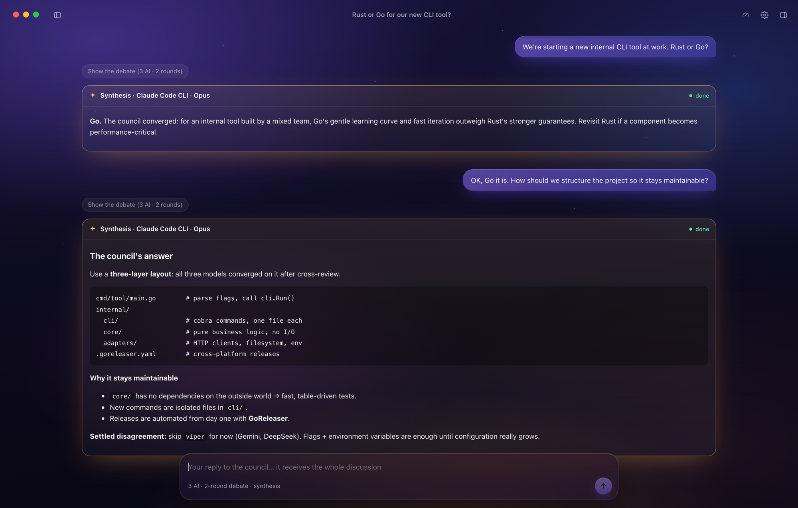<br /><sub><b>Focus mode:</b> both panels collapsed with <code>⌘B</code> / <code>⌘J</code>.</sub></td>
  </tr>
</table>

## Providers

| Type | Providers | Notes |
| --- | --- | --- |
| **CLI agents** | Claude Code CLI, Antigravity CLI | Auto-detected, no API key: they use your subscriptions. They have their own tools (files, shell, web). |
| **Local servers** | LM Studio, Ollama, custom URL | OpenAI-compatible, optional API key. Works across your LAN. LM Studio models that fail to *just-in-time* load are loaded explicitly, and already-loaded models are marked `●`. |
| **Cloud APIs** | Anthropic, OpenAI, Google Gemini, DeepSeek, OpenRouter, Mistral, Groq, xAI, Together AI, Ollama Cloud | One key per provider, stored in the **macOS Keychain**. |

## Web search

Models reached through an API don't browse by themselves: the app gives them two tools and runs them on their behalf.

| Tool | What it does | Cost |
| --- | --- | --- |
| `fetch_url` | Downloads a page and keeps only its readable text | Free |
| `web_search` | Queries the selected search engine | Depends on the engine, see below |

| Engine | Setup | Cost |
| --- | --- | --- |
| **Built-in SearXNG** *(recommended)* | One click in Settings. The app downloads `uv`, a standalone Python and SearXNG into its own folder (~220 MB) and runs it on `127.0.0.1` only. **No Python or other software required.** | Free, no quota |
| **Tavily** | Paste an API key | 1,000 free searches / month |
| **Your SearXNG** | Paste its URL (JSON format enabled) | Free |

> Nothing is downloaded until you click **Install**, and the built-in engine can be disabled or uninstalled at any time.

## Execution modes

These apply to the CLI agents, which can read and edit files in the workspace folder you choose. API models only answer.

| Mode | Claude Code CLI | Antigravity CLI |
| --- | --- | --- |
| **Plan** | `--permission-mode plan` (read-only) | `--mode plan` |
| **Edit** | `acceptEdits` | `accept-edits` |
| **Auto** | `auto`: Claude decides what is safe | falls back to `accept-edits` |
| **Full** | `--dangerously-skip-permissions` | `--dangerously-skip-permissions` |

## Privacy

- **Stays on your Mac**: discussions, provider settings and the council setup (`~/Library/Application Support/dev.magisterium.app`).
- **API keys** live in a single macOS Keychain item, never in a file.
- **Built-in SearXNG** listens on `127.0.0.1` only.
- **What goes out**: your prompts are sent only to the providers you add to the council.

## Install

1. Download the latest `Magisterium_x.y.z_aarch64.dmg` and drag **Magisterium** into Applications.
2. The app is not notarized yet: on first launch, **right-click → Open**.
3. To reach a server on your local network, allow Magisterium in **System Settings › Privacy & Security › Local Network**.

The CLI members need their own tools installed and logged in: [`claude`](https://docs.anthropic.com/en/docs/claude-code) and/or `agy` (Antigravity).

## Build from source

Requirements: [Rust](https://rustup.rs) and Node.js 20+.

```bash
npm install
npm run tauri dev                       # development
npm run tauri build -- --bundles dmg    # release DMG
```

Tests:

```bash
cd src-tauri
cargo test                                            # unit tests
cargo test -- --ignored live_debate --nocapture       # real debate: Claude CLI + Antigravity CLI
cargo test -- --ignored live_builtin_searxng --nocapture   # full SearXNG install in a temp folder
```

Regenerate the README screenshots (headless Chromium, mocked backend, no real API calls):

```bash
npm run screenshots
```

## Project structure

```
src/                      React front-end
  App.tsx                 layout, council panel, streaming, persistence
  TurnView.tsx            a turn: debate rounds, tool uses, reasoning, synthesis
  Settings.tsx            languages, providers, web search, SearXNG installer
  i18n.tsx                EN · FR · ES · AR
src-tauri/src/            Rust back-end
  orchestrator.rs         compare → cross-review rounds → synthesis, retries
  prompts.rs              debate / synthesis prompts in the four languages
  providers/              Claude CLI, Antigravity CLI, OpenAI-compatible, Anthropic
  usage.rs                usage limits: CLI /usage windows, API balances
  tools.rs                web_search & fetch_url
  searxng.rs              on-demand SearXNG install and lifecycle
  config.rs · history.rs  providers, Keychain vault, saved discussions
scripts/screenshots/      mocked backend + capture script for this README
```

## Roadmap

- Web tools for Anthropic-protocol providers
- Signed and notarized builds (Touch ID for the Keychain, no Gatekeeper prompt)
- OAuth providers (GitHub Copilot, ChatGPT subscription)
- Export a discussion to Markdown
- Windows and Linux builds

## License

Magisterium is free software, released under the [GNU Affero General Public License v3.0 or later](LICENSE).
You can use, study, modify and share it. If you distribute a modified version, or run one as a network service, you must publish its source code under the same license.

Copyright © 2026 Okil Lakhdari.

## Credits

Built with [Tauri](https://tauri.app), [React](https://react.dev) and [Rust](https://www.rust-lang.org). Web search powered by [SearXNG](https://github.com/searxng/searxng), installed with [uv](https://github.com/astral-sh/uv) and [python-build-standalone](https://github.com/astral-sh/python-build-standalone). The idea of letting several AIs deliberate together was sparked by PewDiePie's *Odysseus*.
